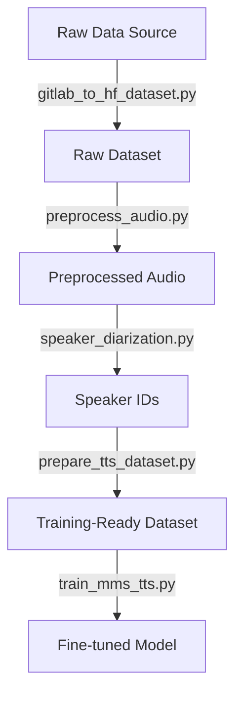

# TTS Fine-tuning Workflow Planning

## Architecture Philosophy

### Generic vs. Specific Separation
- **Generic Tools** (checked into repo): Reusable Python scripts that work for any language/project
- **Language-Specific Config** (YAML files): Project-specific settings, paths, and parameters
- **Pattern**: All scripts accept `--config` parameter to load language-specific YAML

---

## Current Workflow Analysis

### Existing Script: gitlab_to_hf_dataset.py
**Purpose**: Downloads audio + transcriptions from GitLab/local repo to create HuggingFace dataset

**Current Flow**:
1. Reads config from YAML (e.g., `config.yaml`)
2. Lists all CODEX files in repository
3. Extracts audio-transcription pairs
4. Downloads/copies audio files to output directory
5. Creates `metadata.csv` with file_name and transcription columns

**Output Structure**:
```
/path/to/output/
├── audio/
│   ├── audio-file-1.webm
│   ├── audio-file-2.webm
│   └── ...
└── metadata.csv
```

---

## Proposed Workflow Options

### Option A: Sequential Pipeline
**Best for**: Debugging, modularity, clear separation of concerns



**Steps**:
1. **Data Collection** (existing): `gitlab_to_hf_dataset.py --config config.yaml`
   - Output: Raw audio files + metadata.csv

2. **Audio Preprocessing**: `preprocess_audio.py --config config.yaml`
   - Input: Raw audio directory + metadata.csv
   - Output: New preprocessed audio directory + new metadata.csv
   - Creates separate output folder (doesn't modify original)

3. **Speaker Diarization**: `speaker_diarization.py --config config.yaml`
   - Input: Preprocessed audio directory
   - Output: speaker_ids.json (mapping audio files to speaker IDs)

4. **Dataset Preparation**: `prepare_tts_dataset.py --config config.yaml`
   - Input: Preprocessed audio + metadata.csv + speaker_ids.json
   - Output: HuggingFace dataset with train/val splits
   - Adds speaker_id column to dataset

5. **Training**: `train_mms_tts.py --config config.yaml`
   - Input: Prepared HuggingFace dataset
   - Output: Fine-tuned model checkpoints

**Pros**:
- Each step is independent and debuggable
- Can re-run individual steps without redoing everything
- Easy to inspect intermediate outputs
- Clear error isolation
- Each step creates new output (preserves previous steps)

**Cons**:
- Multiple disk writes (more storage needed temporarily)
- Slightly slower overall (multiple passes)

---

### Option B: Integrated Preprocessing in gitlab_to_hf_dataset.py
**Best for**: Single-pass efficiency, less disk usage

Modify existing script to preprocess audio during download/copy:

```python
def download_file(self, file_path: str, output_path: Path) -> bool:
    # Download/copy file
    success = self._download_raw_file(file_path, temp_path)
    
    # If audio file, preprocess it
    if is_audio_file(file_path):
        preprocess_audio(temp_path, output_path)
    
    return success
```

**Pros**:
- Single pass through data
- Less disk space needed
- Faster overall

**Cons**:
- Harder to debug preprocessing issues
- Couples data collection with preprocessing
- Can't easily re-preprocess without re-downloading
- More complex error handling

---

### Option C: Hybrid Approach (Flexible) ⭐ CHOSEN
**Best for**: Balancing efficiency and modularity

Keep scripts separate but add optional preprocessing flag:

```bash
# Option 1: Separate steps (for development/debugging)
python gitlab_to_hf_dataset.py --config config.yaml
python preprocess_audio.py --config config.yaml

# Option 2: Combined (for production - future enhancement)
python gitlab_to_hf_dataset.py --config config.yaml --preprocess
```

**Implementation Plan**:
1. Build standalone scripts first (easier to develop and test)
2. Once working, add integration hooks to gitlab_to_hf_dataset.py
3. Each step creates new output folder (never modifies previous step's output)

**Pros**:
- Flexibility for different use cases
- Can debug with separate steps
- Can run efficiently with combined mode
- Can re-run any step without affecting previous steps

**Cons**:
- More complex implementation (but worth it)
- Need to maintain both code paths

---

## Recommended Approach: Option C (Hybrid - Start with Sequential)

### Rationale
1. **Development First**: Build standalone scripts for easier development and testing
2. **Integration Later**: Add optional integration to gitlab_to_hf_dataset.py once working
3. **Debugging**: Modularity helps during development
4. **Reusability**: Each script can be used independently for other projects
5. **Disk Space**: With 7.67 hours of audio, storage isn't a major concern
6. **Flexibility**: Can re-run any step without affecting previous steps (immutable outputs)

### Key Principle: Immutable Outputs
Each step creates a NEW output directory and metadata.csv, never modifying previous step's outputs. This allows:
- Re-running any step with different parameters
- Comparing results from different parameter settings
- Easy rollback if something goes wrong

---

## Speaker Diarization Workflow

### Challenge
Speaker diarization needs to happen AFTER preprocessing because:
- Consistent audio format (16kHz, mono) improves diarization accuracy
- Speaker embedding models expect specific input format

### Two Approaches

#### Approach 1: Automatic Clustering (Unsupervised)
**Tools**: pyannote.audio, resemblyzer, speechbrain

**Process**:
1. Extract speaker embeddings from each audio file
2. Cluster embeddings using HDBSCAN or K-means
3. Assign speaker IDs based on clusters

**Pros**:
- Fully automatic
- No manual labeling needed

**Cons**:
- May not be perfect (similar voices clustered together)
- Need to determine number of speakers (or use HDBSCAN)

**Code Flow**:
```python
for audio_file in audio_files:
    embedding = extract_speaker_embedding(audio_file)
    embeddings.append(embedding)

# Cluster embeddings
speaker_ids = cluster_embeddings(embeddings)

# Save mapping
save_speaker_mapping(audio_files, speaker_ids)
```

#### Approach 2: Semi-Supervised (with verification)
1. Run automatic clustering
2. Generate sample audio for each cluster
3. Manual verification/correction
4. Re-assign if needed

---

## Directory Structure

### Proposed Layout
```
/path/to/output/
├── raw/                          # Original downloaded files
│   ├── audio/
│   │   ├── file1.webm
│   │   └── file2.webm
│   └── metadata.csv
│
├── preprocessed/                 # After audio preprocessing
│   ├── audio/
│   │   ├── file1.wav
│   │   └── file2.wav
│   └── metadata.csv             # NEW metadata.csv (not modified from raw)
│
├── speaker_analysis/            # Speaker diarization outputs
│   ├── embeddings.npy           # Cached embeddings
│   ├── speaker_ids.json         # Audio file -> speaker ID mapping
│   └── cluster_samples/         # Sample audio per cluster (for verification)
│       ├── speaker_0_sample.wav
│       └── speaker_1_sample.wav
│
└── hf_dataset/                  # Final HuggingFace dataset
    ├── train/
    ├── validation/
    └── dataset_info.json
```

---

## Configuration Structure

### Generic TTS Config (tts_config_template.yaml)
```yaml
# Audio preprocessing
audio:
  sample_rate: 16000
  channels: 1
  bit_depth: 16
  normalize: true
  target_db: -20.0

# Speaker diarization
speaker_diarization:
  method: "pyannote"  # or "resemblyzer"
  min_speakers: null  # null for auto-detect
  max_speakers: null
  clustering_method: "hdbscan"  # or "kmeans"

# Dataset preparation
dataset:
  train_split: 0.9
  val_split: 0.1
  test_split: 0.0
  shuffle: true
  seed: 42

# Training configuration
training:
  base_model: "facebook/mms-tts-cmn"
  output_dir: "/path/to/checkpoints"
  num_epochs: 250
  learning_rate: 1e-4
  batch_size: null  # null for auto
  gradient_accumulation_steps: 4
  mixed_precision: "fp16"
  save_steps: 25
  logging_steps: 10
  warmup_steps: 500
```

### Language-Specific Config (config.yaml)
```yaml
# Extends config.yaml with TTS-specific settings
language:
  name: "config"
  code: "hsn"
  base_model: "facebook/mms-tts-cmn"

paths:
  raw_dataset: "/path/to/output/raw"
  preprocessed: "/path/to/output/preprocessed"
  speaker_analysis: "/path/to/output/speaker_analysis"
  hf_dataset: "/path/to/output/hf_dataset"
  checkpoints: "/home/lansford/vast_ai_tts/checkpoints/config-mms-tts"

# Override defaults if needed
training:
  num_epochs: 300  # More epochs for this language
```

---

## Integration with Existing Script

### Modify gitlab_to_hf_dataset.py Output
Current output goes directly to `dataset.output_dir`. 

**Proposed Change**:
```yaml
# In config.yaml
dataset:
  output_dir: "/path/to/output/raw"  # Add /raw
```

This keeps raw data separate from processed data.

---

## Execution Sequence

### Full Pipeline
```bash
# Step 1: Download/copy raw data (existing script)
python gitlab_to_hf_dataset.py process --config_path config.yaml

# Step 2: Preprocess audio (creates new metadata.csv in output dir)
python preprocess_audio.py \
  --config config.yaml \
  --input_dir /path/to/output/raw/audio \
  --input_metadata /path/to/output/raw/metadata.csv \
  --output_dir /path/to/output/preprocessed

# Step 3: Speaker diarization
python speaker_diarization.py \
  --config config.yaml \
  --audio_dir /path/to/output/preprocessed/audio \
  --output_dir /path/to/output/speaker_analysis

# Step 4: Prepare HF dataset
python prepare_tts_dataset.py \
  --config config.yaml \
  --audio_dir /path/to/output/preprocessed/audio \
  --metadata_csv /path/to/output/preprocessed/metadata.csv \
  --speaker_ids /path/to/output/speaker_analysis/speaker_ids.json \
  --output_dir /path/to/output/hf_dataset

# Step 5: Train model
python train_mms_tts.py \
  --config config.yaml \
  --dataset_path /path/to/output/hf_dataset
```

### Or with Config-Driven Approach
```bash
# All paths in config file
python preprocess_audio.py --config config.yaml
python speaker_diarization.py --config config.yaml
python prepare_tts_dataset.py --config config.yaml
python train_mms_tts.py --config config.yaml
```

---

## Questions Resolved

### 1. Should preprocessing happen during data copy?
**Answer**: Build standalone first, then optionally integrate later (Hybrid approach)

### 2. When should speaker diarization run?
**Answer**: After preprocessing, on standardized audio format

### 3. Where to store speaker IDs?
**Answer**: JSON file mapping audio filenames to speaker IDs, then merge into HF dataset

### 4. How to handle existing gitlab_to_hf_dataset.py?
**Answer**: Minimal change - just update output_dir to include `/raw` subdirectory

### 5. Should we modify metadata.csv or create new one?
**Answer**: Always create NEW metadata.csv in output directory (immutable outputs)

---

## Implementation Strategy

### Phase 1: Standalone Scripts (Current)
Build each script independently:
1. ✅ Audio preprocessing script
2. ⏳ Speaker diarization script
3. ⏳ Dataset preparation script
4. ⏳ Training script

### Phase 2: Integration (Future)
Add optional flags to gitlab_to_hf_dataset.py:
- `--preprocess`: Run audio preprocessing during download
- `--diarize`: Run speaker diarization after preprocessing
- `--prepare-training`: Prepare final training dataset

### Phase 3: Orchestration (Optional)
Create master script that runs full pipeline with single command

---

## Next Steps

1. ✅ Create workflow planning document (this file)
2. ⏳ Create `config.yaml` config file
3. ⏳ Update preprocessing script to:
   - Accept config file
   - Read input metadata.csv
   - Create NEW output directory with NEW metadata.csv
4. ⏳ Create speaker diarization script
5. ⏳ Create dataset preparation script
6. ⏳ Create training script
7. ⏳ Test full pipeline with standalone scripts
8. ⏳ (Future) Integrate into gitlab_to_hf_dataset.py

---

**Last Updated**: 2025-11-28