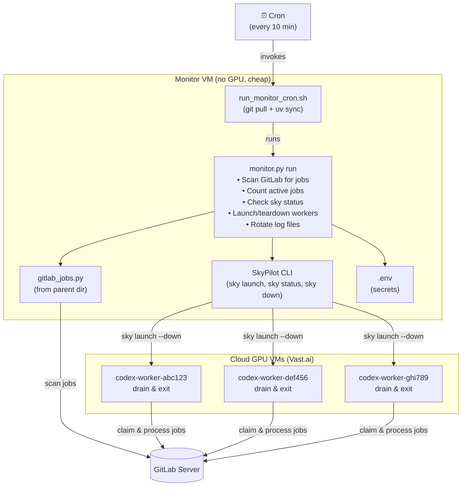
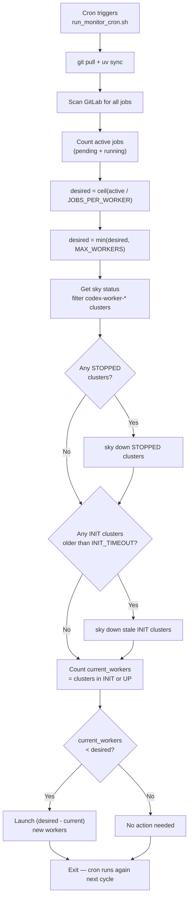

# Launcher Project — Worker Monitor & SkyPilot Launcher

This sub-project contains the **monitor process** and **SkyPilot task files** for launching and managing GPU workers. The monitor runs on a cheap VM (no GPU) and automatically scales workers up and down based on job demand.

## Overview

The monitor is a lightweight Python script that runs a **single monitoring cycle** each time it's invoked. It's designed to be scheduled via **cron** — if it crashes, cron simply runs it again next cycle. No long-running daemon to babysit.

Each cycle:

1. **Pulls latest code** from git (via the bash wrapper)
2. **Scans GitLab** for active jobs (pending + running)
3. **Calculates** how many workers are needed: `ceil(active_jobs / 4)`
4. **Checks** how many SkyPilot workers are currently running
5. **Launches** new workers if more are needed (up to a configurable max)
6. **Cleans up** workers in invalid states (STOPPED, stale INIT)

Workers are launched in **drain-and-exit mode** (`--down`), meaning they process all available jobs and then self-terminate — no idle GPU charges.

## Architecture



## Files

| File | Description |
|------|-------------|
| `monitor.py` | Main Python monitor script (single-cycle, cron-friendly) |
| `run_monitor_cron.sh` | Bash wrapper: git pull + uv sync + run monitor.py |
| `.env.template` | Template showing all required/optional env vars (committed to git) |
| `.env` | Your actual secrets (git-ignored, copy from template) |
| `pyproject.toml` | Python dependencies for the launcher sub-project |
| `skypilot_worker.yaml` | SkyPilot task: drain-and-exit worker (used by monitor) |
| `skypilot_worker_polling.yaml` | SkyPilot task: persistent polling worker |
| `skypilot_force_job.yaml` | SkyPilot task: force-run a specific job |
| `skypilot_dryrun.yaml` | SkyPilot task: test setup and connectivity |
| `dryrun_test.py` | Python script for dry-run testing |

## Quick Start

### 1. Prerequisites

- Python 3.10+
- [uv](https://docs.astral.sh/uv/) package manager
- SkyPilot cloud credentials configured (run `sky check`)
- GitLab access token

### 2. Clone and Setup

```bash
git clone --recurse-submodules https://github.com/JEdward7777/codex-job-worker.git
cd codex-job-worker/launcher_project

# Install uv if not already installed
curl -LsSf https://astral.sh/uv/install.sh | sh

# Install dependencies
uv sync
```

### 3. Configure Secrets

```bash
# Copy the template
cp .env.template .env

# Edit .env and fill in your GITLAB_TOKEN
nano .env
```

### 4. Verify SkyPilot Credentials

```bash
uv run sky check
```

If Vast.ai (or your preferred cloud) is not configured, follow the [SkyPilot installation guide](https://skypilot.readthedocs.io/en/latest/getting-started/installation.html).

### 5. Test with Dry Run

```bash
# Dry run: scans jobs and checks status, but doesn't launch or tear down anything
bash run_monitor_cron.sh --dry-run
```

This will:
- Pull latest code from git
- Sync dependencies
- Connect to GitLab and count active jobs
- Check SkyPilot cluster status
- Log what it **would** do (launch/teardown) without actually doing it

### 6. Run a Real Cycle

```bash
# Single monitoring cycle (launches workers if needed)
bash run_monitor_cron.sh
```

### 7. Schedule with Cron

```bash
crontab -e
```

Add one of these lines:

```cron
# Every 10 minutes (recommended)
*/10 * * * * flock -n /tmp/monitor.lock -c 'cd /path/to/codex-job-worker/launcher_project && bash run_monitor_cron.sh' >> /var/log/monitor_cron.log 2>&1

# Every 5 minutes (more responsive)
*/5 * * * * flock -n /tmp/monitor.lock -c 'cd /path/to/codex-job-worker/launcher_project && bash run_monitor_cron.sh' >> /var/log/monitor_cron.log 2>&1
```

> **Note**: The `flock` command prevents overlapping runs. If a previous cycle is still running when cron fires again, the new invocation is silently skipped.

## Dry Run Mode

The `--dry-run` flag is the recommended way to test the monitor. It performs all the same steps as a real cycle but:

- ✅ Connects to GitLab and scans for jobs
- ✅ Counts active jobs and calculates desired workers
- ✅ Checks SkyPilot cluster status
- ✅ Identifies clusters that need cleanup
- ❌ Does NOT launch any new workers
- ❌ Does NOT tear down any clusters
- ❌ Does NOT check SkyPilot cloud credentials (since no actual provisioning)

```bash
# Via the bash wrapper (includes git pull)
bash run_monitor_cron.sh --dry-run

# Or directly via Python
uv run python monitor.py run --dry-run

# With verbose GitLab scanning output
uv run python monitor.py run --dry-run --verbose
```

## Status Command

Check the current state without taking any action:

```bash
uv run python monitor.py status
```

This shows:
- Number of active jobs (pending + running)
- List of `codex-worker-*` clusters and their states

## Configuration

All configuration is done via the `.env` file or environment variables. CLI arguments can also override any setting.

### Environment Variables

| Variable | Required | Default | Description |
|----------|----------|---------|-------------|
| `GITLAB_TOKEN` | **Yes** | — | GitLab access token for scanning jobs |
| `GITLAB_URL` | No | `https://git.genesisrnd.com` | GitLab server URL |
| `MAX_WORKERS` | No | `5` | Maximum concurrent GPU workers |
| `JOBS_PER_WORKER` | No | `4` | Number of jobs per worker (for scaling formula) |
| `INIT_TIMEOUT` | No | `1800` | Seconds before tearing down stuck INIT clusters |
| `WORKER_YAML` | No | `skypilot_worker.yaml` | Path to the SkyPilot worker task file |
| `LOG_FILE` | No | `monitor.log` | Path to the log file |

> **Note**: `POLL_INTERVAL` is no longer used — scheduling is handled by cron.

### Scaling Formula

```
active_jobs = count of jobs in "pending" or "running" state
desired_workers = min(ceil(active_jobs / JOBS_PER_WORKER), MAX_WORKERS)
workers_to_launch = max(0, desired_workers - current_running_workers)
```

### Monitor Cycle Flowchart



## Job State Classification

The monitor counts jobs based on their state (as defined in the [INITIAL_BUILD_INSTRUCTIONS.md](../../codex_worker_frontend/INITIAL_BUILD_INSTRUCTIONS.md) spec):

| State | How Detected | Counted as Active? |
|-------|-------------|-------------------|
| **pending** | No `response.yaml` exists, `canceled` not `true` | ✅ Yes |
| **running** | `response.yaml` exists with `state: running` | ✅ Yes |
| **completed** | `response.yaml` has `state: completed` | ❌ No |
| **failed** | `response.yaml` has `state: failed` | ❌ No |
| **canceled** | Manifest has `canceled: true` (with or without response) | ❌ No |

## Worker Naming & Identity

- **Cluster name**: `codex-worker-{short_uuid}` (e.g., `codex-worker-a1b2c3d4`)
- **WORKER_ID**: Same as the cluster name
- **Prefix**: `codex-worker-` — the monitor assumes ownership of all clusters matching this prefix
- Workers are launched via:
  ```bash
  sky launch skypilot_worker.yaml \
    --cluster codex-worker-{uuid} \
    --down \
    --env GITLAB_TOKEN=... \
    --env WORKER_ID=codex-worker-{uuid} \
    --detach-run \
    -y
  ```

## Worker Cleanup

On each monitoring cycle, the monitor cleans up invalid workers:

| Cluster State | Action |
|---------------|--------|
| **STOPPED** | Tear down immediately (`sky down`) — not doing work, may incur storage costs |
| **INIT** (stale) | Tear down if stuck longer than `INIT_TIMEOUT` (default 30 min) — likely failed to provision |
| **UP** (running) | Leave alone — let drain-and-exit handle natural termination |
| **UP** (0 jobs needed) | Leave alone — don't proactively kill running workers |

## Code Update Mechanism

The `run_monitor_cron.sh` bash wrapper handles code updates automatically:

1. **Git pull**: Every cron invocation runs `git pull origin main` before the monitor
2. **Dependency sync**: Runs `uv sync` in case `pyproject.toml` changed
3. **Function wrapping**: The entire script body is inside `main()`, parsed into memory before execution — safe against mid-execution file changes from `git pull`

Since cron runs the script fresh each time, there's no need for a long-running daemon or restart mechanism. Each invocation gets the latest code.

## Logging

The monitor uses Python's built-in `logging` module with:

- **stdout**: All log messages printed to console (captured by cron's output redirect)
- **Rotating log file**: `monitor.log` (configurable) with automatic rotation
  - Max file size: 10 MB
  - Keeps 5 rotated backups
  - Old logs are automatically gzip-compressed (e.g., `monitor.log.1.gz`)

Uses `logging.handlers.RotatingFileHandler` with Python's built-in `gzip` module for compression — no third-party dependencies needed.

## SkyPilot Task Files

### `skypilot_worker.yaml` — Drain-and-Exit Worker (Default)

**Used by the monitor.** Processes all available jobs, then exits. Launched with `--down` so the VM auto-terminates when idle.

```bash
sky launch skypilot_worker.yaml --down --env GITLAB_TOKEN --env WORKER_ID
```

### `skypilot_worker_polling.yaml` — Persistent Polling Worker

Stays alive and polls for new jobs. Useful for development or when you want a dedicated always-on worker.

```bash
sky launch skypilot_worker_polling.yaml --env GITLAB_TOKEN --env WORKER_ID
```

### `skypilot_force_job.yaml` — Force-Run a Specific Job

Re-run a specific job (e.g., after fixing a bug). Skips the normal claim cycle.

```bash
sky launch skypilot_force_job.yaml \
  --env GITLAB_TOKEN --env WORKER_ID \
  --env FORCE_JOB=123:my_job_42
```

### `skypilot_dryrun.yaml` — Lightweight Connectivity Test

A minimal YAML that provisions a VM, echoes a message, and exits. Used by `test_launch --dry-run` to verify that SkyPilot can provision VMs on Vast.ai without running the full worker stack.

```bash
sky launch skypilot_dryrun.yaml --down --env GITLAB_TOKEN
```

## Test Launch Command

The `test_launch` command verifies the SkyPilot → Vast.ai pipeline end-to-end:

```bash
# Full worker test: launches the actual worker YAML, scans for jobs, processes
# any it finds, then auto-terminates. If no jobs exist, it exits immediately.
# Useful for verifying the full pipeline or running a one-off job.
uv run python monitor.py test_launch

# Lightweight dryrun: only tests VM provisioning (echoes a message and exits).
# Does NOT run the worker or scan for jobs.
uv run python monitor.py test_launch --dry-run

# Keep the VM alive after it finishes (for SSH exploration).
# You must manually tear it down with: sky down codex-test-launch
uv run python monitor.py test_launch --keep-alive
uv run python monitor.py test_launch --dry-run --keep-alive
```

## Import Strategy

The monitor imports `gitlab_jobs.py` from the parent directory using a `sys.path` hack:

```python
import sys, os
sys.path.insert(0, os.path.join(os.path.dirname(__file__), '..'))
from gitlab_jobs import GitLabJobScanner
```

This avoids installing the full worker dependencies (torch, transformers, etc.) in the monitor's lightweight venv. The monitor only needs the dependencies that `gitlab_jobs.py` uses: `python-gitlab`, `pyyaml`, `fire`.

## Dependencies

The `pyproject.toml` for this sub-project includes only lightweight dependencies:

```toml
dependencies = [
    "skypilot[vast]>=0.9.0",
    "python-dotenv>=1.0.0",
    "python-gitlab>=4.0.0",
    "pyyaml>=6.0",
    "fire>=0.5.0",
]
```

No GPU libraries (torch, transformers, etc.) are needed on the monitor VM.

## Troubleshooting

### "No GitLab token provided"

Set `GITLAB_TOKEN` in your `.env` file or as an environment variable.

### "SkyPilot cloud credentials not configured"

Run `sky check` and follow the instructions to configure your cloud provider. For Vast.ai, see the [Vast.ai SkyPilot integration guide](https://vast.ai/article/vast-ai-gpus-can-now-be-rentend-through-skypilot).

### Workers not launching

1. Check `monitor.log` for errors
2. Verify `sky check` shows your cloud provider as enabled
3. Try launching a worker manually: `sky launch skypilot_worker.yaml --down --env GITLAB_TOKEN --env WORKER_ID=test-1`

### Workers stuck in INIT state

The monitor will automatically tear down clusters stuck in INIT for longer than `INIT_TIMEOUT` (default 30 minutes). If this happens frequently, the cloud provider may be having capacity issues — try a different region or GPU type.

### Too many workers launching

Reduce `MAX_WORKERS` in your `.env` file. The default is 5.

### Cron not running or SkyPilot fails from cron

Cron runs with a minimal environment (`PATH=/usr/bin:/bin`, no `~/.bashrc`). The `run_monitor_cron.sh` script sources `~/.bashrc` or `~/.profile` to get the full environment, but if you still have issues:

1. Check cron logs: `grep CRON /var/log/syslog`
2. Verify the crontab entry: `crontab -l`
3. Make sure the paths in the crontab are absolute
4. Check `/var/log/monitor_cron.log` for output
5. Verify cloud credentials are available: if your cloud API key (e.g., `VAST_API_KEY`) is set in `~/.bashrc`, make sure `~/.bashrc` doesn't exit early for non-interactive shells (some default `.bashrc` files have `[ -z "$PS1" ] && return` at the top)
6. Test the cron environment manually:
   ```bash
   env -i HOME=$HOME LOGNAME=$USER PATH=/usr/bin:/bin SHELL=/bin/sh \
     bash /path/to/launcher_project/run_monitor_cron.sh --dry-run
   ```
